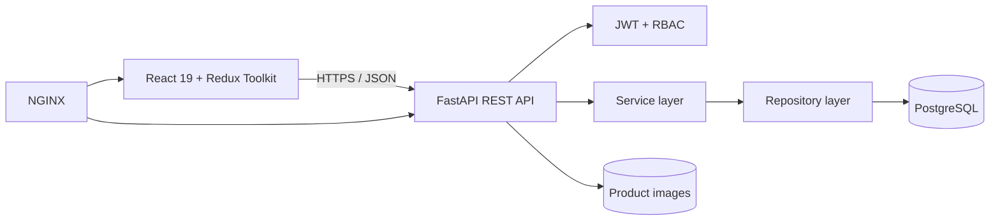

# Architecture

The API routes perform transport validation and authorization only. Services own transactions and business rules. Repositories encapsulate reusable persistence operations. SQLAlchemy models define database integrity; Pydantic schemas define the API contract.

