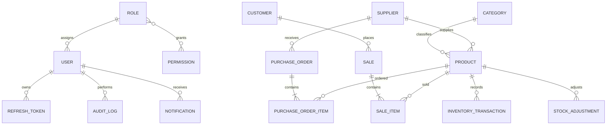

# Entity relationship diagram

```mermaid
erDiagram
  ROLE ||--o{ USER : assigns
  ROLE }o--o{ PERMISSION : grants
  USER ||--o{ REFRESH_TOKEN : owns
  CATEGORY ||--o{ PRODUCT : classifies
  SUPPLIER ||--o{ PRODUCT : supplies
  SUPPLIER ||--o{ PURCHASE_ORDER : receives
  PURCHASE_ORDER ||--|{ PURCHASE_ORDER_ITEM : contains
  PRODUCT ||--o{ PURCHASE_ORDER_ITEM : ordered
  CUSTOMER ||--o{ SALE : places
  SALE ||--|{ SALE_ITEM : contains
  PRODUCT ||--o{ SALE_ITEM : sold
  PRODUCT ||--o{ INVENTORY_TRANSACTION : records
  PRODUCT ||--o{ STOCK_ADJUSTMENT : adjusts
  USER ||--o{ AUDIT_LOG : performs
  USER ||--o{ NOTIFICATION : receives
```

